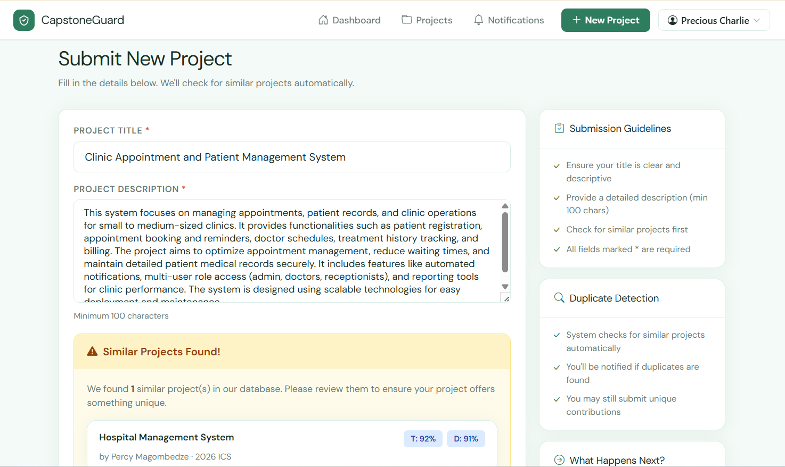

# CapstoneGuard

> An academic project submission and duplicate detection platform for universities and institutions. Students submit capstone projects and the system automatically flags semantic duplicates using AI-powered embeddings, catching paraphrased similarities that basic string matching misses.

---



## Features

- **AI Duplicate Detection** — Uses Google Gemini embeddings (`gemini-embedding-001`) to semantically compare project titles and descriptions, catching paraphrased duplicates with configurable similarity thresholds
- **Live Duplicate Check** — Real-time feedback as students type via HTMX, before they even submit
- **Role-Based Access** — Four roles: Student, Supervisor, Reviewer and Admin, each with different permissions
- **Chapter-by-Chapter Workflow** — Projects progress through 6 chapters (Introduction → Conclusion), each unlocked only after supervisor approval
- **HIT200 / HIT400 Support** — Team projects (HIT200) with group supervision and solo projects (HIT400) with individual supervisor assignment
- **Project Lifecycle Management** — Full status workflow: `Pending → Under Review → Approved / Rejected`
- **Stream Organisation** — Projects are categorised by academic streams (e.g. 2026 ICS, 2026 ISE)
- **Notifications** — In-app notifications for duplicate warnings, status changes, chapter approvals and comments
- **Commenting System** — Reviewers and students can discuss projects via threaded comments
- **Similarity Records** — Every flagged duplicate stores title, description and overall similarity scores for audit trails

---

## Tech Stack

| Layer | Technology |
|---|---|
| Backend | Python 3, Flask |
| Database | SQLAlchemy ORM (PostgreSQL / SQLite) |
| AI / Embeddings | Google Gemini API (`gemini-embedding-001`) |
| Frontend | Jinja2 templates, Bulma CSS, Bootstrap Icons |
| Reactivity | HTMX (live duplicate check, paginated project list) |
| Typography | DM Sans (Google Fonts) |
| Auth | Google OAuth 2.0 (institutional Google accounts) |
| Config | python-dotenv |

---

## Getting Started

### Prerequisites

- Python 3.9+
- A [Google AI Studio](https://aistudio.google.com/app/apikey) API key (free, no credit card needed)
- A Google Cloud project with OAuth 2.0 credentials (see setup below)

### Installation

**1. Clone the repository**
```bash
git clone https://github.com/elgombe/capstone-guard.git
cd capstone-guard
```

**2. Create and activate a virtual environment**
```bash
python -m venv venv
source venv/bin/activate      # Windows: venv\Scripts\activate
```

**3. Install dependencies**
```bash
pip install -r requirements.txt
```

**4. Set up Google OAuth credentials** — see the [full guide below](#setting-up-google-oauth-credentials)

**5. Configure environment variables**

Create a `.env` file in the project root:
```env
# Flask
SECRET_KEY=your-secret-key-here
FLASK_ENV=development

# Database
DATABASE_URI=sqlite:///capstoneguard.db

# Google Gemini (free at https://aistudio.google.com/app/apikey)
GEMINI_API_KEY=your-gemini-api-key-here

# Similarity Thresholds
SIMILARITY_THRESHOLD=0.82
TITLE_SIMILARITY_WEIGHT=0.4
DESCRIPTION_SIMILARITY_WEIGHT=0.6

# Admin credentials
ADMIN_EMAIL=your-admin-email
ADMIN_PASSWORD=your-admin-password

# Google OAuth (see setup guide below)
GOOGLE_CLIENT_ID=your-client-id.apps.googleusercontent.com
GOOGLE_CLIENT_SECRET=your-client-secret
```

**6. Run the development server**
```bash
flask run
```

Visit `http://localhost:5000`

---

## Setting Up Google OAuth Credentials

CapstoneGuard uses Google OAuth 2.0 so students and supervisors log in with their institutional Google accounts (`@hit.ac.zw`). Follow these steps to obtain your `GOOGLE_CLIENT_ID` and `GOOGLE_CLIENT_SECRET`.

### Step 1 — Create a Google Cloud Project

1. Go to [https://console.cloud.google.com](https://console.cloud.google.com)
2. Click the project selector at the top → **New Project**
3. Enter a project name (e.g. `CapstoneGuard`) and click **Create**
4. Make sure the new project is selected in the top bar

### Step 2 — Enable the Google OAuth API

1. In the left sidebar go to **APIs & Services → Library**
2. Search for **Google Identity** or **Google+ API**
3. Click **Google Identity Toolkit API** (or **People API**) → **Enable**

### Step 3 — Configure the OAuth Consent Screen

1. Go to **APIs & Services → OAuth consent screen**
2. Select **External** (allows any Google account to log in) → **Create**
3. Fill in the required fields:
   - **App name**: `CapstoneGuard`
   - **User support email**: your email address
   - **Developer contact email**: your email address
4. Click **Save and Continue** through the Scopes and Test Users screens
5. On the Summary screen click **Back to Dashboard**

> **Tip:** While in development the app is in "Testing" mode. Add test users (your Google accounts) under **OAuth consent screen → Test users**. To allow all users, click **Publish App** to move to production.

### Step 4 — Create OAuth 2.0 Credentials

1. Go to **APIs & Services → Credentials**
2. Click **+ Create Credentials → OAuth client ID**
3. For **Application type** select **Web application**
4. Give it a name (e.g. `CapstoneGuard Web`)
5. Under **Authorised redirect URIs** click **+ Add URI** and add:
   ```
   http://localhost:5000/auth/google/callback
   ```
   If deploying to production also add your live domain:
   ```
   https://yourdomain.com/auth/google/callback
   ```
6. Click **Create**
7. A dialog will show your credentials — copy them immediately:
   - **Client ID** → paste as `GOOGLE_CLIENT_ID` in your `.env`
   - **Client Secret** → paste as `GOOGLE_CLIENT_SECRET` in your `.env`

> You can always retrieve these again from **APIs & Services → Credentials** by clicking the pencil icon next to your OAuth client.

### Step 5 — Verify your `.env`

```env
GOOGLE_CLIENT_ID=123456789-abcdefghijklmnop.apps.googleusercontent.com
GOOGLE_CLIENT_SECRET=GOCSPX-xxxxxxxxxxxxxxxxxxxxxxxx
```

### Restricting to Institutional Accounts (Optional but Recommended)

If you want to restrict login to `@hit.ac.zw` accounts only, add a check in your Google OAuth callback handler:

```python
# In your auth blueprint callback
if not user_info['email'].endswith('@hit.ac.zw'):
    flash('Only @hit.ac.zw accounts are permitted.', 'danger')
    return redirect(url_for('auth_bp.login'))
```

---

## How Duplicate Detection Works

When a project is submitted (or while the student is still typing), CapstoneGuard:

1. Generates a 768-dimensional embedding vector for the incoming **title** and **description** using `gemini-embedding-001` with `SEMANTIC_SIMILARITY` task type
2. Generates embeddings for **every project** in the database (all statuses, all categories)
3. Computes **cosine similarity** between the vectors
4. Calculates a weighted **overall similarity score**:
   ```
   overall = (TITLE_WEIGHT × title_similarity) + (DESC_WEIGHT × desc_similarity)
   ```
5. Any project exceeding the `SIMILARITY_THRESHOLD` is flagged, stored as a `SimilarityRecord` and triggers a notification

This approach catches paraphrased duplicates that character-level methods (like `difflib.SequenceMatcher`) miss entirely. The check runs across **both HIT200 and HIT400 projects** — a team project cannot duplicate a solo project and vice versa.

### Tuning the Threshold

| `SIMILARITY_THRESHOLD` | Behaviour |
|---|---|
| `0.75` | More sensitive — catches loose similarities, higher false positives |
| `0.82` | Recommended — catches paraphrased duplicates reliably (default) |
| `0.90` | Strict — only flags near-identical submissions |

---

## User Roles

| Role | Permissions |
|---|---|
| **Student** | Submit projects, edit own projects, submit chapters, add comments, view notifications |
| **Supervisor** | Manage HIT200 groups and HIT400 students, review and approve/reject chapters |
| **Reviewer** | All student permissions + update project status, add review notes |
| **Admin** | Full platform access — manage supervisors, assign students, review chapters and projects |

---

## Project Workflow

```
Student submits project (title + description)
        ↓
AI similarity check runs across all projects
        ↓
Supervisor reviews and approves the project proposal
        ↓
6 chapter slots created — Chapter 1 unlocked
        ↓
Student submits Chapter 1 → Supervisor reviews
  ├── Approved → Chapter 2 unlocked
  └── Needs Revision → Student revises and resubmits
        ↓
... repeat for Chapters 2 → 6
        ↓
All 6 chapters approved → Project complete
```

---

## API Endpoints

| Method | Endpoint | Description |
|---|---|---|
| `GET` | `/` | Landing page |
| `GET` | `/dashboard` | User dashboard |
| `GET` | `/projects` | Browse all projects |
| `GET POST` | `/projects/new` | Submit a new project (students only) |
| `GET` | `/projects/<id>` | Project detail |
| `GET POST` | `/projects/<id>/edit` | Edit project |
| `POST` | `/projects/<id>/status` | Update status (supervisor/reviewer/admin) |
| `POST` | `/projects/<id>/comments` | Add a comment |
| `GET` | `/projects/<id>/chapters` | Chapter overview |
| `GET POST` | `/projects/<id>/chapters/<order>` | Chapter detail / submit / review |
| `GET` | `/groups` | HIT200 group management (supervisors) |
| `GET` | `/notifications` | Notification centre |
| `POST` | `/htmx/check-duplicate` | Live duplicate check (HTMX) |
| `GET` | `/htmx/projects` | Paginated project list (HTMX) |

---

## Environment Variables Reference

| Variable | Default | Description |
|---|---|---|
| `SECRET_KEY` | — | Flask session secret key |
| `DATABASE_URI` | — | SQLAlchemy database URI |
| `GEMINI_API_KEY` | — | Google Gemini API key (AI duplicate detection) |
| `SIMILARITY_THRESHOLD` | `0.82` | Minimum score to flag a duplicate |
| `TITLE_SIMILARITY_WEIGHT` | `0.4` | Weight given to title similarity |
| `DESCRIPTION_SIMILARITY_WEIGHT` | `0.6` | Weight given to description similarity |
| `ADMIN_EMAIL` | — | Email for the default admin account |
| `ADMIN_PASSWORD` | — | Password for the default admin account |
| `GOOGLE_CLIENT_ID` | — | OAuth 2.0 Client ID from Google Cloud Console |
| `GOOGLE_CLIENT_SECRET` | — | OAuth 2.0 Client Secret from Google Cloud Console |

---

## License

MIT License — see `LICENSE` for details.